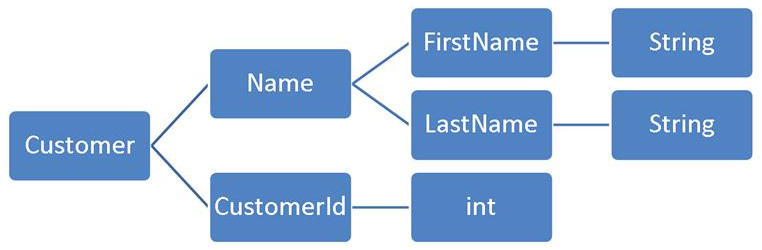

박재성 님의 `자바 플레이그라운드 with TDD` 강의를 들으면서 좋은 코드를 작성할 수 있는 여러 팁을 배우고 있다. 그 중 수업 초기부터 등장하는 `객체지향 생활체조 원칙`이 재미있다. 이 용어는 마틴 파울러의 책 `소트웍스 앤솔러지` 중 6장의 제목이다. 6장 서두에 이런 말이 나온다.

> 좋은 객체지향 설계는 배우기 어려울 수 있다. 그러나 간결함에 있어 무한한 결실을 맺을 수도 있다. 절차적 개발에서 객체지향 설계로의 이전은 겉보기보다 더 어려운 사고의 중대한 전환이 필요하다.

나도 Java라는 언어로 처음 프로그래밍을 배웠고 지금도 자주 사용하지만 여전히 객체지향적인 사고방식이 많이 부족함을 느낀다. `객체지향 생활체조 원칙`은 객체지향적 사고방식을 익히기 위해 단순하면서도 쉽게 적용할 수 있는 9가지 원칙이다. 생활체조라는 것이 매일 아침 간단하게 반복할 수 있으면서 건강을 지키는 좋은 운동법이라는 측면에서 이 아홉가지 원칙도 객체지향적 사고를 발달시키는 단순하면서 좋은 준비운동 방법에 빗댄 표현이 아닐까 추측해본다. 다소 국민학교스러운 느낌이 난다.

9가지 원칙은 다음과 같다.

1. 한 메서드에 오직 한 단계의 들여쓰기만 한다.
2. else 예약어(keyword)는 쓰지 않는다.
3. 모든 원시값과 문자열을 포장한다.
4. 일급(first-class) 콜렉션을 쓴다.
5. 한 줄에 점을 하나만 찍는다.
6. 줄여쓰지 않는다(축약 금지).
7. 모든 엔티티(entity)를 작게 유지한다.
8. 2개 이상의 인스턴스 변수를 가진 클래스를 쓰지 않는다.
9. 게터(getter)/세터(setter)/프로퍼티(property)를 쓰지 않는다.


# 규칙 1 : 메서드당 들여쓰기 한 번
거대한 메서드는 응집력이 떨어지기 때문에 한 메서드는 정확히 한가지의 일만 담당하도록 하는 것이 좋다. 한 가지 일만 담당하는 메서드를 만들면 코드가 달라지기 시작한다. 애플리케이션의 유닛이 더 작아짐에 따라 재사용의 수준은 기하급수적으로 상승하기 시작한다. 이를 위해 메서드에 들여쓰기가 1단계만 남을 때 까지 동작 코드를 뽑아낸다.

아래는 하나의 메서드를 여러 개로 쪼갠 예시 코드이다.

```java
class Board {
    public String board() {
        StringBuilder buf = new StringBuilder();

        // 0단계
        for (int i = 0; i < 10; i++) {
            // 1단계
            for (int j = 0; j < 10; j++) {
                // 2단계
                buf.append(data[i][j]);
            }
            buf.append("\n");
        }

        return buf.toString();
    }
}
```

위 코드를 아래처럼 쪼갠다.
```java
class Board {
    public String board() {
        StringBuilder buf = new StringBuilder();

        collectRows(buf);

        return buf.toString();
    }

    private void collectRows(StringBuilder buf) {
        for (int i = 0; i < 10; i++) {
            collectRow(buf, i);
        }
    }

    private void collectRow(StringBuilder buf, int row) {
        for (int i = 0; i < 10; i++) {
            buf.append(data[row][i]);
        }

        buf.append("\n");
    }
}
```

각각의 메서드의 들여쓰기가 1단계를 넘어가지 않는다. 이로써 코드를 더 읽기 쉽고 재사용하기 쉽게 만들었다. 이와 같이 리팩터링하면 디버깅을 하기도 대체로 훨씬 쉬워진다.

# 규칙 2 : else 예약어 금지
if/else 구문은 거의 모든 프로그래밍 언어가 가지고 있다. 아마 대부분의 개발자가 여러 겹으로 중첩된 조건문을 접한 경험이 있을 것이다. 이럴 경우 리팩토링하기 보다는 분기를 하나 더 만드는 것이 쉬울 것이다. 이럴 경우 결국 코드의 품질은 점점 떨어지게 된다.

```java
public void login(String username, String password) {
    if (userRepository.isValid(username, password)) {
        redirect("homepage");
    } else {
        addFlash("error", "Bad credentials");

        redirect("login");
    }
}

```

else 키워드를 제거하는 방법은 조기 반환(early return)을 사용하는 것이다.
```java
public void login(String username, String password) {
    if (userRepository.isValid(username, password)) {
        redirect("homepage");
        return;
    }

    addFlash("error", "Bad credentials");

    redirect("login");
}
```

위와 같이 수정할 경우 여러 장점이 있다. error 조건이 있다면 에러 케이스에 해당할 경우 조기 반환으로 메서드가 종료되고, 나머지 코드는 기본 로직을 따라가는 방법을 쓸 수 있다. 아니면 방어적 접근법을 적용할 수도 있다. 기본 로직를 조건으로 걸고, 조건에 만족하지 않는 경우 에러 상태를 리턴하는 방법이다. 개발자가 미처 생각하지 못한 잠재적 에러를 예방하는 좋은 방법이 될 수 있다.


혹은 변수를 사용해 아래와 같이 수정할 수도 있다.

```java
public void login(String username, String password) {
    String redirectRoute = "homepage";

    if (!userRepository.isValid(username, password)) {
        addFlash("error", "Bad credentials");
        redirectRoute = "login";
    }

    redirect(redirectRoute);
}
```
객체지향 언어는 다향성이라는 강력한 도구를 통해 복잡한 조건문을 처리할 수 있다. 간단한 경우라면 보호절과 조기 반환으로 대체 가능하다. 다형성을 채택한 설계는 읽고 유지하기 쉬우며 더욱 분명히 코드의 의도를 표현할 수  있다. 이것을 연습하기 위해 else 사용을 금지하는 것이다. Null 객체 패턴, State, 전략 패턴(Strategy Pattern)을 시도해보면 몇몇 상황에서도 도움이 될 것이다.


# 규칙 3 : 원시값과 문자열의 포장 
이 원칙은 모든 원시값(primitive)을 객체로 포장하는 것이다. 원시형 데이터는 아무런 의미를 담고있지 않다. 그저 변수명으로서만 그 의미를 추론할 수 있을 뿐이다. 그러나 원시값을 클래스로 감싼다면 그 데이터가 무엇인지, 그리고 왜 사용해야 하는지를 보다 명확하게 전달할 수 있다.


# 규칙 4: 일급 콜렉션 사용 (First Class Collection)
콜렉션(Collection)을 가진 클래스는 콜렉션 외에는 다른 멤버 변수를 가지면 안된다는 원칙이다. 어떤 데이터 세트(Set)를 가지고 있는데 조작이 필요하다면 그 데이터에만 집중된 클래스를 만들어야 한다. 규칙3과 비슷하게 콜렉션을 클래스로 포장하는 것이다. 이로써 콜렉션과 관련된 코드의 중복을 막을 수 있고, 강제로 데이터를 캡슐화한다는 점에서 더 객체지향적인 코드를 작성할 수 있다.


코드로 살펴보자. 아래의 코드에서 멤버변수 List<Car> cars에 주목하자.
```java
public class RacingGame {
  private final List<Car> cars;
  //...
    
  public RacingGame(String carInputs) {
    cars = initCars(carInputs.trim());
  }
  // ...
}
```

아래 코드는 위의 코드를 수정한 것이다. List<Car>를 Cars 클래스로 감싼 것을 볼 수 있다.  이렇게 함으로써 데이터를 감춤과 동시에 중요한 데이터를 전담으로 관리하는 클래스를 따로 만들어 인터페이스를 단순화시킬 수 있다.

```java
public class RacingGame {
  private final Cars cars;
  // ...
    public RacingGame(String carInputs) {
      cars = initCars(carInputs);
    }
  // ...
}

Public class Cars {
  private final List<Car> cars;
  
  public Cars(List<Car> cars) {
    this.cars = cars;
  }
  // ...
}
```
여기서는 너무 단순하게 정리해놨지만, 일급컬렉션을 잘 사용하면 많은 장점을 얻을 수 있다. [이동욱님의 글](https://jojoldu.tistory.com/412)을 참고하면 좋을 것 같다. 일급컬렉션에 대해 매우 자세한 글을 올려주셨다.

# 규칙 5 : 한 줄에 한 점만 사용

점(.)은 자바나 C#에서 메서드를 호출할 때 사용한다. 이 원칙은 디미터의 법칙과 연관이 깊다. 책에서는 이렇게 말한다. "자기 소유의 장난감, 자기가 만든 장난감, 그리고 누군가 자기에게 준 장남감하고만 놀 수 있다. 하지만 절대 장난감의 장난감과 놀면 안된다." 쉽게 말하면, 한 객체가 너무 먼 객체를 불러와서 사용하는 것을 지양해야 한다는 것이다.


```java
class Location {
    public Piece current;
}

class Piece {
    public String representation;
}

class Board {
    public String boardRepresentation() {
        StringBuilder buf = new StringBuilder();

        for (Location loc : squares()) {
            // 주목!
            buf.append(loc.current.representation.substring(0, 1));
        }

        return buf.toString();
    }
}
```

위 코드에서 boardRepresentaion() 메서드를 살펴보자. 그 중에서도 아래의 코드라인에 주목하자.

```java
buf.append(loc.current.representation.substring(0, 1));
```

Location에 접근한 다음 Piece에 접근하고, 그 다음엔 Piece의 representation에 접근하여 작업을 수행하고 있다. 이 코드는 한 줄에 한 점만 사용한다는 원칙과 꾀나 거리가 있다. 디미터의 법칙에 따라 아래와 같이 수정해보자.

```java
class Location {
    private Piece current;

    public void addTo(StringBuilder buf) {
        current.addTo(buf);
    }
}
```

Piece 인스턴스를 private으로 변경하여 프로그래머가 뭔가 잘못을 저지를 가능성을 제거했다. 그러나 이 인스턴스에 어떤 작업을 요청해야 하므로 새로운 메서드 addTo()를 추가했다. Piece가 어떻게 추가될 지 결정하는 것은 Location의 책임이 아니므로 Piece에 요청하도록 하자.

```java
class Piece {
    private String representation;

    public String character() {
        return representation.substring(0, 1);
    }

    public void addTo(StringBuilder buf) {
        buf.append(character());
    }
}
```

이번에도 접근제어자를 private으로 바꿔주었다. 이로써 데이터의 변경은 막고 확장을 위해서는 열어둘 수 있게 된다.


이제 새 메서드에서 representation의 첫 문자를 가져오는 것이 꽤 좋아보인다. 이와 같은 변경을 통해 언젠가 해당 기능을 재사용할 수도 있게 되었다. 최종적으로 수정된  Board 클래스는 아래와 같다.

```java
class Board {
    public String boardRepresentation() {
        StringBuilder buf = new StringBuilder();

        for (Location location : squares()) {
            location.addTo(buf);
        }

        return buf.toString();
    }
}
```
처음에 여러 점으로 연속 호출이 사용되었던 코드와 비교에 한결 간결해졌다.

# 규칙 6 : 축약 금지
> 누구나 실은 클래스, 메서드, 또는 변수의 이름을 줄이려는 유혹에 곧잘 빠진다. 그런 유혹을 뿌리쳐라. 축약은 혼란을 야기하며, 더 큰 문제를 숨기는 경향이 있다.

우리가 던져야 할 옳은 질문은 다음과 같다.

**"애초에 왜 축약을 하려고 하는가?"**

이 질문에 어쩌면 우리는 어떤 메서드나 변수의 이름을 계속 입력해야하기 때문이라고 대답할 수도 있다. 그렇다면 우리 코드는 여러 차례 중복을 일으키고 있을 가능성이 높다. 혹은 메서드의 이름이 너무 길어지기 때문이라고 말할 수도 있다. 그렇다면 우리가 작성한 클래스는 많은 책임을 안고 있다는 것이고, 이것은 [단일 책임 원칙](https://en.wikipedia.org/wiki/Single-responsibility_principle)에 위배되기 때문에 좋지 않다고 할 수 있다.


만약 클래스나 메서드에 붙일 적당한 이름을 찾지 못한다면 뭔가 잘못되었을 가능성이 높다. 즉 클래스나 메서드에 명확한 이름을 붙일 수 있으려면 그 역할과 책임이 단순해야 한다.

# 규칙 7 : 모든 엔티티를 작게 유지
50줄 이상 되는 클래스와 10개 이상의 파일을 가진 패키지는 없어야 한다. 물론 이 기준은 프로그래머에 따라 바뀔 수 있는 여지가 있다. 50줄이 너무 적다면 150줄로 바꿀 수 있을 것이다. 긴 파일은 짧은 파일에 비해 읽기 어렵고, 따라서 이해하기도 어렵고, 결국 유지보수하기도 어려워진다.


작은 클래스를 만들고 유지하는데 따르는 어려움은 함께 있어야 논리적으로 말이 되는 행동의 묶음이 있는 경우다. 이럴 때는 패키지를 최대한 활용해야 한다. 우리의 클래스가 작아지고 역할도 줄어든다면, 그리고 패키지의 사이즈가 작게 유지된다면 패키지가 하나의 목적을 달성하기 위해 모인 관련 클래스들의 집합(cluster)이라는 것을 알게 될 것이다. 패키지도 클래스처럼 응집력 있고 단일한 목표가 있어야 한다. 패키지를 작게 유지함으로써 패키지 자체로 진정한 정체성을 지닐 수 있게 된다.


# 규칙 8 : 2개 이상의 인스턴스 변수를 가진 클래스 사용 금지
대부분의 클래스들이 하나의 상태 변수를 처리하는 일을 맡아야 마땅하지만, 몇몇 경우 둘이 필요할 때가 있다. 새로운 인스턴스 변수를 하나 더 기존 클래스에 추가하면 그 클래스의 응집도는 즉시 떨어진다. 많은 인스턴스를 가진 클래스로 응집력 있는 단일 작업을 하기란 어렵다.  이 규칙은 규칙3(모든 원시값과 문자열을 포장한다), 규칙4(일급 컬렉션을 사용한다)와 같은 형태라고 할 수 있다.


아래의 예시을 보면 이해가 쉬울 것이다. Customer 클래스가 FirstName, LastName, CustomerId를 모두 가지고 있는 대신, 문자열과 정수값을 포장한 하위 클래스들의 계층구조를 가지게 됨으로써 오로지 Name과 CustomerId, 두 클래스만 관리를 하고 있다.



# 규칙 9 : getter/setter/properties 사용 금지
이 규칙은 ["말은 하되, 묻지는 말라.(Tell, don't ask)"](https://www.martinfowler.com/bliki/TellDontAsk.html)로 대변된다. 객체의 상태를 가져오는 접근자(accessor)를 사용하는 것은 괜찮지만, 객체 바깥에서 그 결과값을 사용해 객체에 대한 결정을 내리는 것은 안된다. 한 객체의 상태에 대한 결정은 어떤 것이든 그 객체 안에서만 이루어져야 한다. 이 때문에 종종 getter/setter가 나쁜 것으로 여겨지곤 하는 것이다. 다시 말하면 getter/setter는 [Open/Closed](https://en.wikipedia.org/wiki/Open%E2%80%93closed_principle) 원칙을 위배한다.

```java
// Game
private int score;

public void setScore(int score) {
    this.score = score;
}

public int getScore() {
    return score;
}

// Usage
game.setScore(game.getScore() + ENEMY_DESTROYED_SCORE);
```
위의 코드에서 getScore() 메서드가 어떤 결정을 내리는 용도로 사용되고 있다. Game 인스턴스에 그 책임을 부여하는 대신 말이다.


이보다 더 나은 코드를 작성해보자. getter/setter 를 제거하고 다른 메서드를 만들 것이다. 기억해야 할 것은 클래스에 무엇을 할 지 말 해야지, 물어보면 안된다는 것이다. 아래의 수정된 코드에서는 game에게 score를 수정하라고 말하고 있다.

```java
// Game
public void addScore(int delta) {
    score += delta;
}

// Usage
game.addScore(ENEMY_DESTROYED_SCORE);
```

score를 어떻게 수정할지 결정하는 것은 Game의 책임 하에 있다.

이 경우 getScore()는 남겨두어서 UI에서 score를 표시하기 위해 사용할 수도 있다. 그러나 setters는 허용되지 않는다.


# 결론
위 9가지 원칙들은 비교적 단순하지만, 막상 지키려고 하면 만만치 않다는 것을 느낀다. 이 중 몇가지는 항상 적용하지만 나머지 몇 가지는 지키기 정말 쉽지 않고, 아직 제대로 사용하지 못하고 있는 것들도 있다. 더 연습을 하면서 체화시켜야 겠다. 책 서두에 나온 글귀처럼, 객체지향 설계를 배우기는 어려울지라도 무한한 결실을 맺을 수 있기에.


## 참고한 웹사이트
- [Object Calisthenics](https://williamdurand.fr/2013/06/03/object-calisthenics/#8-no-classes-with-more-than-two-instance-variables)
- [일급 컬렉션 (First Class Collection)의 소개와 써야할 이유](https://jojoldu.tistory.com/412)